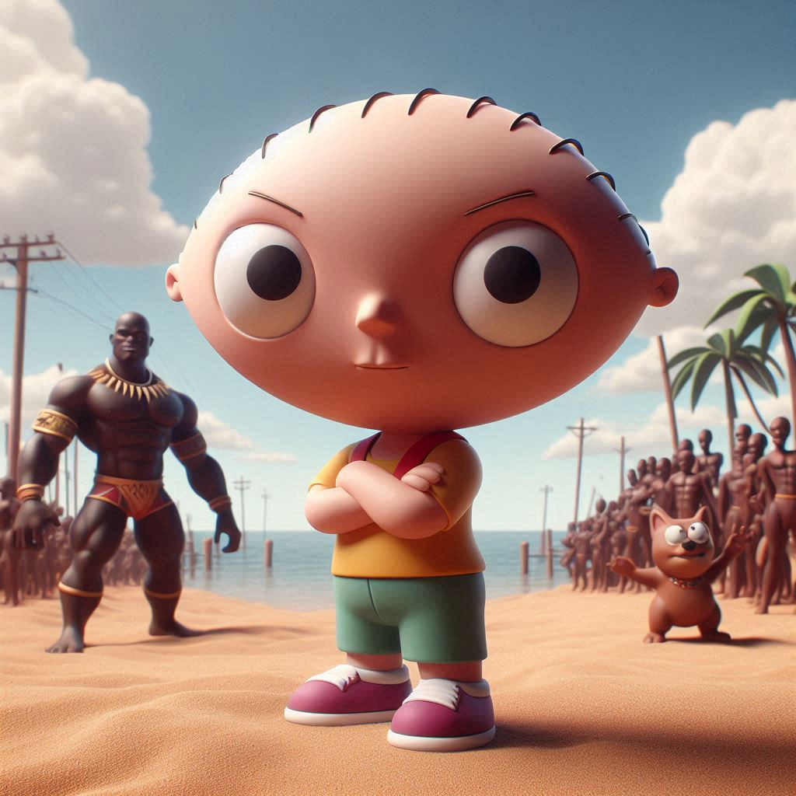
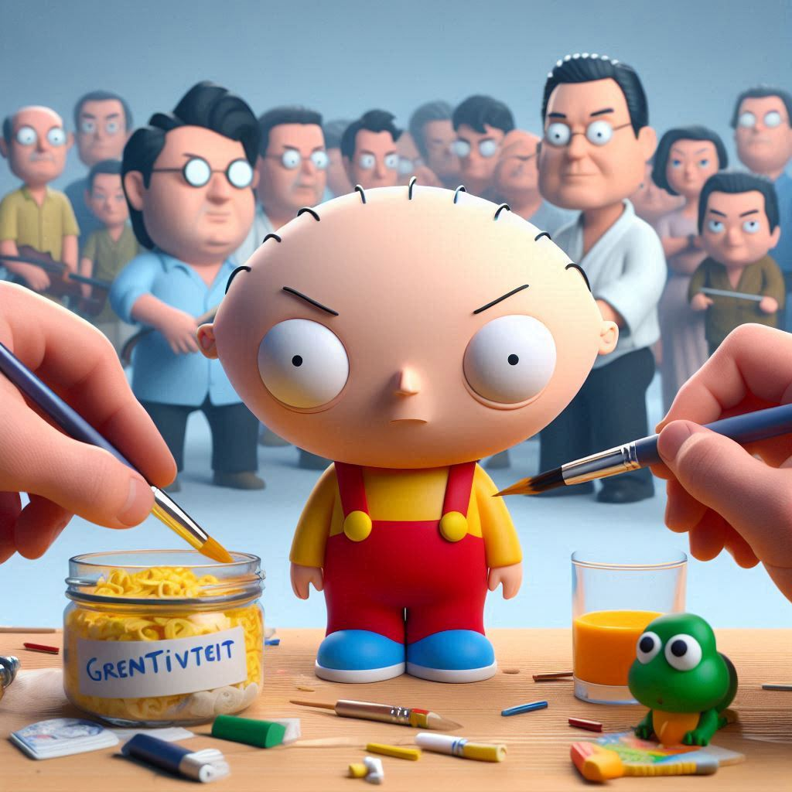
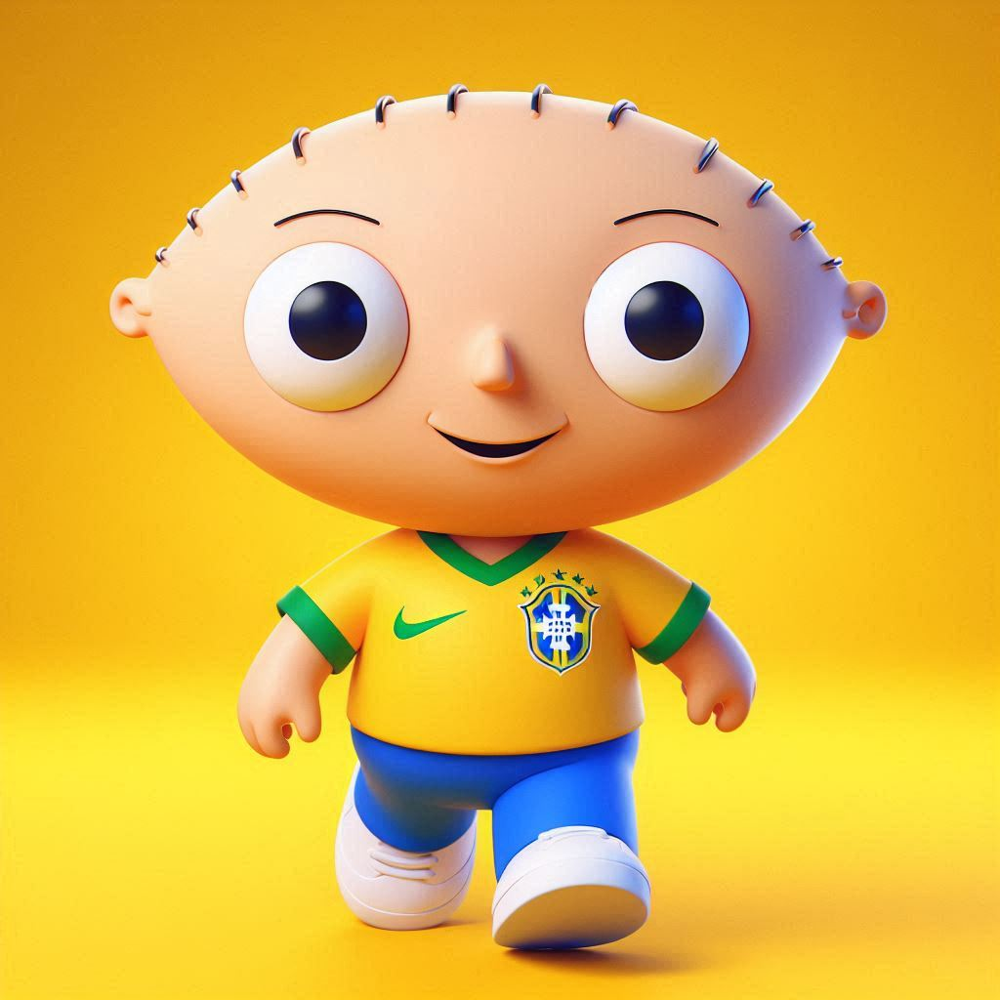
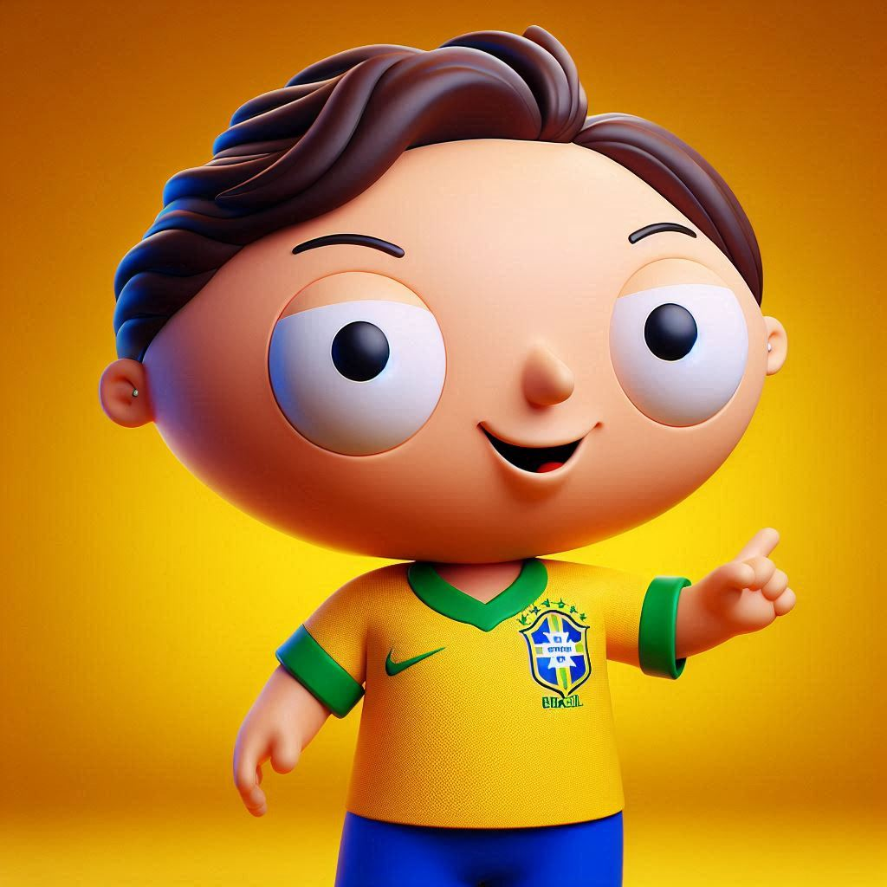
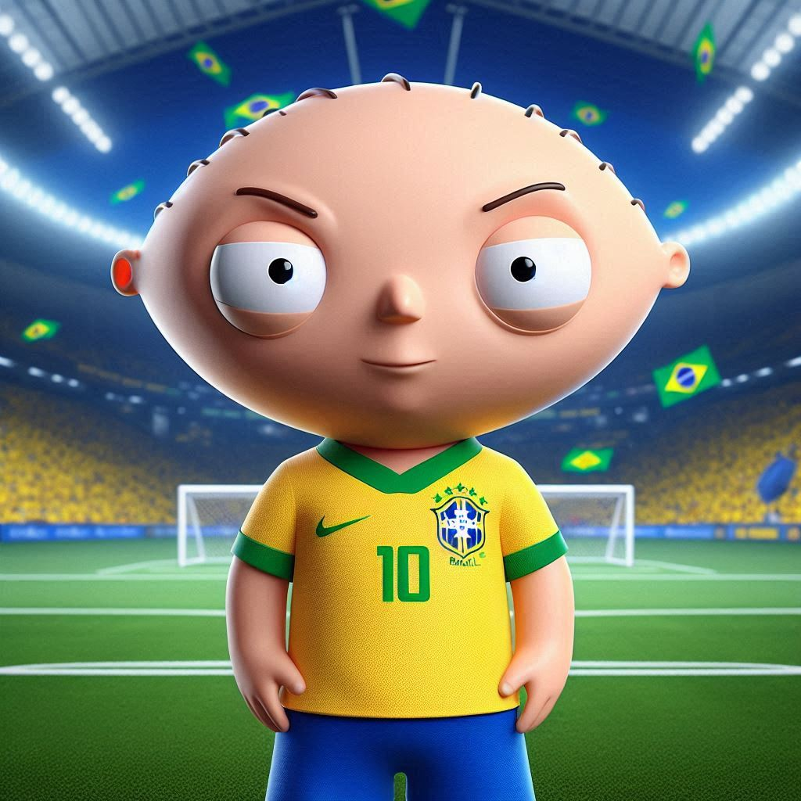
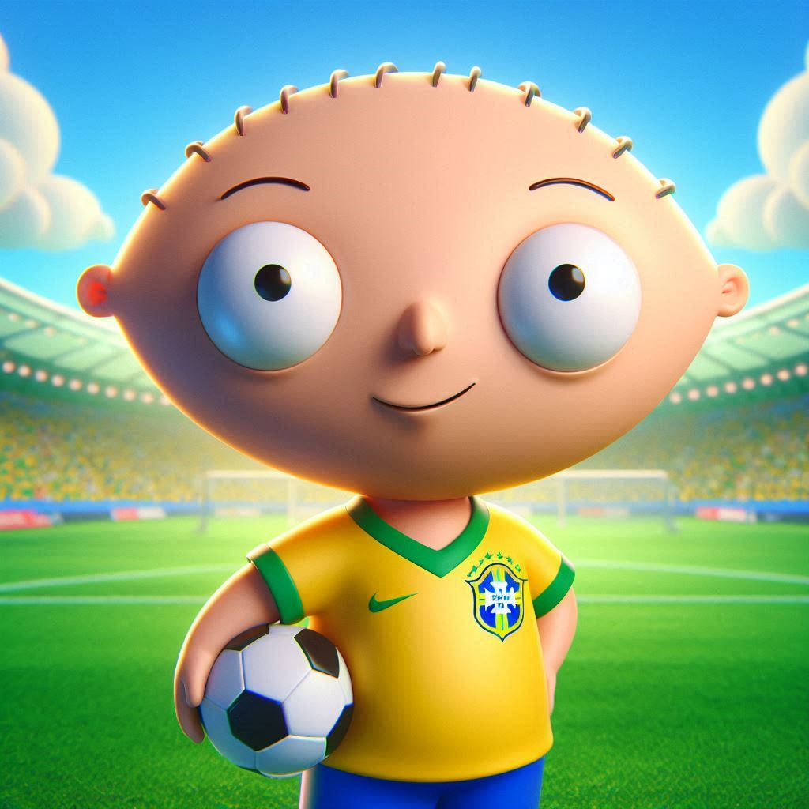
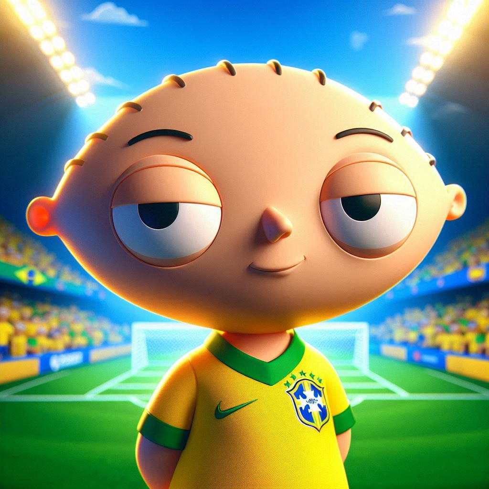

# Desafio final do curso Microsoft & DIO de Microsoft Copilot

## 📒 Descrição
Neste projeto, criei uma modificação de uma ilustração do personagem da série *The Family Guy*. O objetivo dessa modificação era dar ao personagem o aspecto e as características de um personagem da Pixar.

## 🤖 Tecnologias Utilizadas
- **[Microsoft Copilot](https://copilot.microsoft.com/)** para gerar as imagens.

## 🧐 Processo de Criação

 {: width="50%"}


1. Para o prompt de entrada, carreguei a imagem de input e digitei o seguinte prompt:  **A imagem anexada é de um desenho popular chamado The Family Guy, o personagem em questão é Stewie Griffin. Quero que trasforme a imagem que está em 2D para um imagem no estilo Pixar.**
2. O Copilot me entregou variações de imagens satisfatórias.
3. Começei a fazer prompts de aperfeiçoamento na imagem gerada, a primeira variação foi: **Acrescente a camisa do Brasil no personagem**
4. Pedi mais uma variação: **Acrescente um campo de futebol ao fundo**
5. E por final usei uma variação sugerida pelo próprio Copilot: **Mude a iluminação para parecer um dia ensolarado no Brasil**

## 🚀 Resultados

Aqui estão as imagens geradas pelo prompts inseridos:











## 💭 Reflexão
A inteligência artificial já é uma realidade na minha área de atuação, o audiovisual. No meu caso, ela otimizou diversos aspectos do meu trabalho, incluindo a criação de legendas, vozes sintéticas, imagens e, mais recentemente, até vídeos. Acredito que há muito a ser discutido em relação à ética no uso das IAs para o audiovisual e o cinema. No entanto, para mim, essa tecnologia tem sido uma excelente ferramenta de auxílio e otimização do trabalho. 
```
